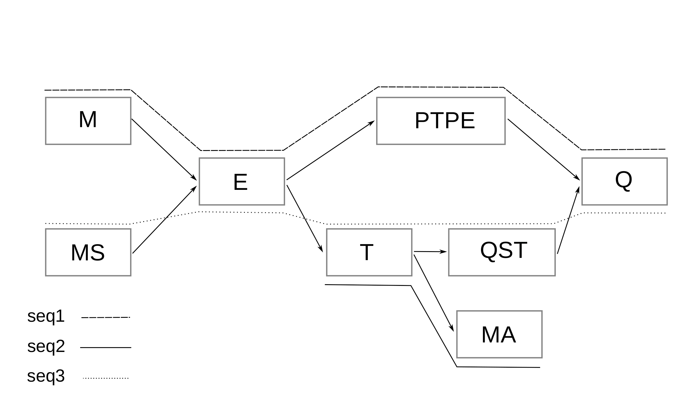

# MSA to GFA
Small python program to turn MSA to GFA v1 with paths of original sequences, it can be then visualized with [gfaviz](https://github.com/ggonnella/gfaviz), 
or [bandage](https://rrwick.github.io/Bandage/) or any other avialble GFA visualization tools out there.

The following options are available from calling main:
```
usage: main.py [-h] [-f MSA_PATH] [-o OUT_GFA] [-n SEQ_NAMES] [-c COLORS]
               [--log LOG_FILE]

Build GFA v1 from MSA given in FASTA format

optional arguments:
  -h, --help            show this help message and exit
  -f MSA_PATH, --in_msa MSA_PATH
                        Input MSA in FASTA format
  --compact             If this give, the graph will be compacted before writing
  -o OUT_GFA, --out OUT_GFA
                        Output GFA name/path
  -n SEQ_NAMES, --seq_name_tsv SEQ_NAMES
                        A tsv with two columns, first is sequence names,
                        second is a shortened or abbreviated name
  -c COLORS, --nodes_info COLORS
                        Output JSON file with nodes information
  --log LOG_FILE        Log file name/path. Default = out_log.log

```

You simply need to provide the MSA in a FASTA format, the output file location. And in case the sequence names in the FASTA file 
is a bit long or complicated and you want to simplify these names (because these names will be used as the path names in the GFA output) 
, you can provide a TSV file with first column has the same sequence names in the FASTA file (without the ">") and the second column 
is the abbreviation or the the other name you want to be used. E.g:

We have the following 3 amino acid sequences:
```
>seq1
-MEPTPEQ
>seq2
---T--MA
>seq3
MSETQSTQ
```
The TSV file you can provide would be:
```
seq1    s1
seq2    s2
seq3    s3
```

The option `-c, --nodes_info` will output a json file with each line a dictionary with
node id, node sequence, and the sequences associated with that node. Maybe it can help identify 
highly conserved regions (the node "colors" can help in this for example).
The graph of the previous sequences would look like

